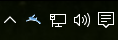
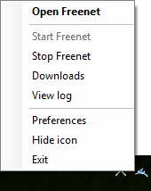
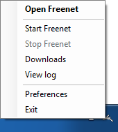
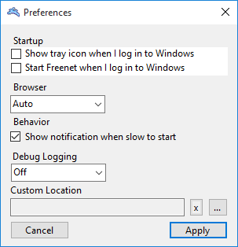
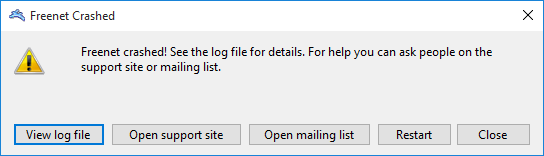

# Freenet Tray Application

This Windows tray application allows starting and stopping Freenet, and opening browsers. ([supported browsers](Browsers/)) It opens Freenet when left-clicked and offers a menu when right-clicked.

## Screenshots

## Motivation

This is a replacement for the AutoHotKey tray application. It aims to have more robust localization support, not be false-positived by overzealous antivirus heuristics that hate scripting languages, and have a few more features: setting which browser to open and hiding the tray icon.

It uses .NET 3.5 because it is [distributed with 7](http://msdn.microsoft.com/en-us/library/bb822049%28v=vs.110%29.aspx), which is [still supported](http://windows.microsoft.com/en-us/windows/lifecycle) and has a significant market share unlike Vista. 3.0 doesn't include some useful things. Existing installs can continue to use the AHK application.

TODO:

* Can the ntservice parts of wrapper.conf be removed?
* Allow one instance open at a time. If another instance is given a command line command pass it to the existing instance.

## Menu items | command line options

Command line options are executed from left to right, so `-othercommand -hide` will perform actions, then exit the tray application.

### First run | -welcome

This shows a balloon tip about using the tray and opens Freenet like -open. This suppresses the slow start notification.

### Open Freenet | -open

Open Freenet's dashboard with a browser in privacy mode. If Freenet is not running it is started. The default browser preference is [seen here](Browsers/BrowserUtil.cs#L31), and a specific browser can be set instead in the preferences window.

### Start Freenet | -start

Start Freenet.

### Stop Freenet | -stop

Stop Freenet.

### Open downloads directory | -downloads

Open the downloads directory in Windows Explorer.

### View logs | -logs

Open `wrapper.log` in notepad.

### Preferences | -preferences

Set the browser to use, and whether to start the icon or start Freenet on startup.

### Hide icon | -hide

Hide the icon by closing the tray application. If Freenet is stopped this menu entry is hidden.

### Exit | -exit

Stop Freenet if it is running and close the tray application.

## Translations

Translations are primarily contributed through Transifex:

* [Commands](https://www.transifex.com/projects/p/freenet/resource/windows-tray-commands/)
* [Common](https://www.transifex.com/projects/p/freenet/resource/windows-tray-common/)
* [Crash](https://www.transifex.com/projects/p/freenet/resource/windows-tray-crash/)
* [Preferences](https://www.transifex.com/projects/p/freenet/resource/windows-tray-preferences/)

The `<resource>.en.resx` files are made with the `wintray-filter-resx` script
which filters strings which do not need to be translated. The script uses
`filter-resx` from the [scripts repository](https://github.com/freenet/scripts/blob/master/filter-resx).

This is because Transifex displays all `ResX` entries, but the Windows Forms
Designer includes things like button size and font which do not need to be
translated.

## Feature requests and reporting bugs

Please file any bugs or feature requests on the
[Freenet Project issue tracker](https://bugs.freenetproject.org/bug_report_page.php)
in the `wininstaller` category.
